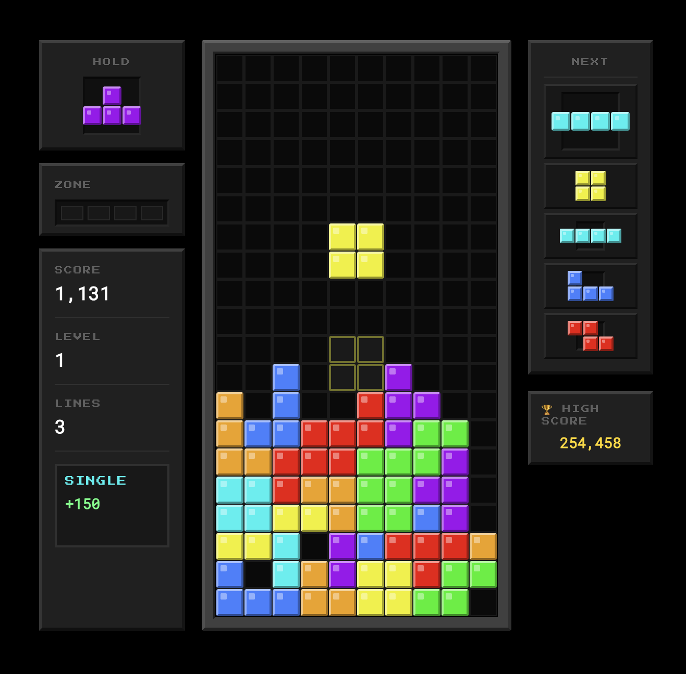

# Blocks

A browser-based block puzzle game featuring the Zone mechanic, neon aesthetics, and full gamepad support.

**[Play Now](https://eduardo3rd.github.io/blocks/)**



## Features

- **Zone Mechanic** - Fill the meter by clearing lines, then freeze time to stack lines at the bottom for massive combos
- **Super Rotation System (SRS)** - Full wall kick support for all 7 pieces
- **T-Spin Detection** - Mini and full T-spins with proper scoring
- **Modern Scoring** - Combos, back-to-back bonuses, and perfect clears
- **Ghost Piece** - See where your piece will land
- **Hold Queue** - Store a piece for later
- **Next Queue** - Preview up to 5 upcoming pieces
- **7-Bag Randomizer** - Fair piece distribution
- **Gamepad Support** - Full DualSense/Xbox controller support
- **Mobile Support** - GameBoy-inspired touch controls for phones
- **Synthesized Audio** - Web Audio API sound effects
- **Online Leaderboard** - Compete for high scores

## Quick Start

```bash
npm install
npm run dev
```

Open [http://localhost:5173](http://localhost:5173) to play.

## Controls

### Keyboard

| Action | Keys |
|--------|------|
| Move | ← → |
| Soft Drop | ↓ |
| Hard Drop | Space |
| Rotate CW | ↑ or X |
| Rotate CCW | Z |
| Rotate 180° | A |
| Hold | C or Shift |
| Zone | E |
| Pause | Escape |

### Gamepad (PlayStation Layout)

| Action | Button |
|--------|--------|
| Move | D-Pad ← → |
| Soft Drop | D-Pad ↓ |
| Hard Drop | D-Pad ↑ |
| Rotate CW | Cross (×) |
| Rotate CCW | Circle (○) |
| Hold | L1 / R1 |
| Zone | L2 / R2 |
| Pause | Options |

### Mobile

Swipe gestures with GameBoy-style button overlay for rotation and zone activation.

## Tech Stack

- React 18 with TypeScript
- Vite for build tooling
- CSS Modules + Tailwind CSS
- Web Audio API for synthesized SFX
- Supabase for leaderboard

## Architecture

See [ARCHITECTURE.md](./ARCHITECTURE.md) for technical details on the engine, state management, and rendering pipeline.

## License

MIT
